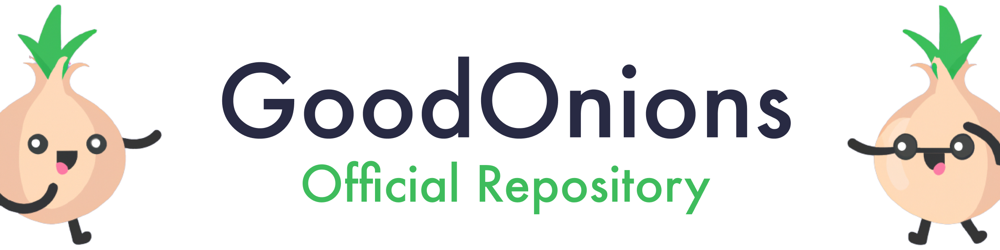

# Lab 1 for ID2223 Course @ KTH

**Keywords:** scalable machine learning, data engineering, classification, model ensemble

    

## Team

**Name:** GoodOnions\
**Components:** [Federico Bono](https://github.com/FredBonux), [Daniele Cipollone](https://github.com/dancip00)

## Project description

This laboratory is composed by two main tasks: a guided implementation of a ML pipeline for a classification task for
the Iris dataset and an autonomous design and implementation of a ML pipeline for either regression or
classification task for the Wine Quality dataset.
In details we will need to build two small applications, one for on-demand inference and the other to monitor the model
performance over time. We will also need to develop a script that generates a new entry every day to test our
system.

### Goal

The main goal is to design and implement the ML pipeline for classification on the Wine Quality dataset, we have followed
this steps:

1. [Exploratory Data Analysis (EDA)](./wine/wine-eda-and-backfill-feature-group.ipynb)
2. [Feature engineering and selection with data cleaning](./wine/wine-eda-and-backfill-feature-group.ipynb)
3. [Backfill training data](./wine/wine-eda-and-backfill-feature-group.ipynb)
4. [Setup of the training pipeline](./wine/wine-training-pipeline.ipynb)
5. [Setup of the inference pipeline](./wine/wine-inference-pipeline.py)
6. [Setup automatic daily entry generator](./wine/wine-daily.py)
7. Setup of the two frontend applications
   1. [Realtime inference](./wine/huggingface-wine/app.py)
   2. [Model performance monitor](./wine/huggingface-wine-monitor/app.py)

### Public links
1. [Realtime inference](https://huggingface.co/spaces/GoodOnions/ID2223-Lab1-Wine)
2. [Model performance monitor](https://huggingface.co/spaces/GoodOnions/ID2223-Lab1-Wine-Monitor)

## References

- [Related Kaggle challenge](https://www.kaggle.com/datasets/rajyellow46/wine-quality)
- [Complete analysis by Marcelo Marques](https://www.kaggle.com/code/mgmarques/wines-type-and-quality-classification-exercises#Wine-Type-and-Quality-Classification)